# Lab 1

## Что выбрано

- Алгоритм с учителем: `RandomForestClassifier`.
- Датасет: OpenML `diabetes` (`data_id=37`).
- Целевая функция: средняя `accuracy` на `4-fold CV`.
- Количество точек на метод: `48` (в 1.5 раза больше, чем раньше `32`).
- Оптимизируемые гиперпараметры (7 шт.):
  `n_estimators`, `max_depth`, `min_samples_split`, `min_samples_leaf`,
  `max_features`, `bootstrap`, `criterion`.

## Выполнено

1. Выбран алгоритм с большим числом гиперпараметров (`RandomForestClassifier`).
2. Выбран датасет и метрика (OpenML `diabetes`, `4-fold CV accuracy`).
3. Реализованы вручную:
   - случайный поиск;
   - байесовская оптимизация (`GaussianProcessRegressor` + `Expected Improvement`).
4. Проведено сравнение ручных `Bayesian` vs `Random`.
5. Построен график значения целевой функции от шага.
6. Построена визуализация пространства гиперпараметров (PCA-проекция в 2D, цвет = score).
7. Оценена важность гиперпараметров (`RandomForestRegressor.feature_importances_` на истории трайлов).
8. Повторены шаги 4-7 через `Optuna` (`TPESampler` vs `RandomSampler`).

## Структура 

- `auto_lab1/run_auto_lab1.py` - CLI-точка входа.
- `auto_lab1/src/auto_lab1/config.py` - конфиг эксперимента.
- `auto_lab1/src/auto_lab1/search_space.py` - пространство гиперпараметров, кодирование/декодирование.
- `auto_lab1/src/auto_lab1/objective.py` - датасет и целевая функция.
- `auto_lab1/src/auto_lab1/manual_search.py` - ручный random search и BO.
- `auto_lab1/src/auto_lab1/optuna_search.py` - Optuna random/TPE.
- `auto_lab1/src/auto_lab1/plotting.py` - построение графиков.
- `auto_lab1/src/auto_lab1/reporting.py` - summary и importance.
- `auto_lab1/src/auto_lab1/pipeline.py` - оркестрация всего пайплайна.

## Результаты

### Ручная реализация

| method | best_score | best_step | mean_score |
| --- | --- | --- | --- |
| manual_bo | 0.77734 | 26 | 0.76676 |
| manual_random | 0.77214 | 37 | 0.76294 |

Итог: ручной BO лучше случайного поиска по лучшему найденному значению метрики.

### Optuna

| method | best_score | best_step | mean_score |
| --- | --- | --- | --- |
| optuna_tpe | 0.78776 | 17 | 0.76953 |
| optuna_random | 0.78516 | 9 | 0.76389 |

Итог: `Optuna TPE` тоже лучше `Optuna Random`.

## Графики

### Manual: best score vs step

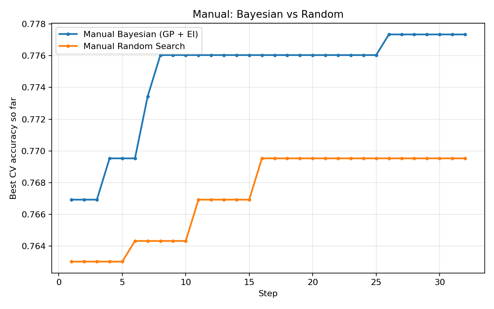

### Manual: space projection

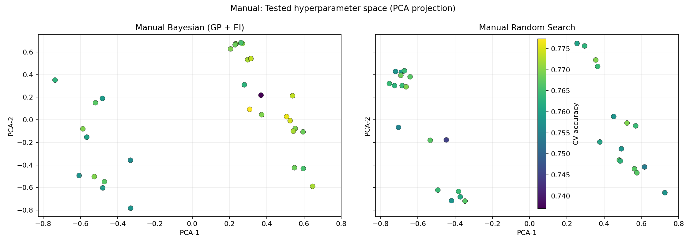

### Manual: hyperparameter importance

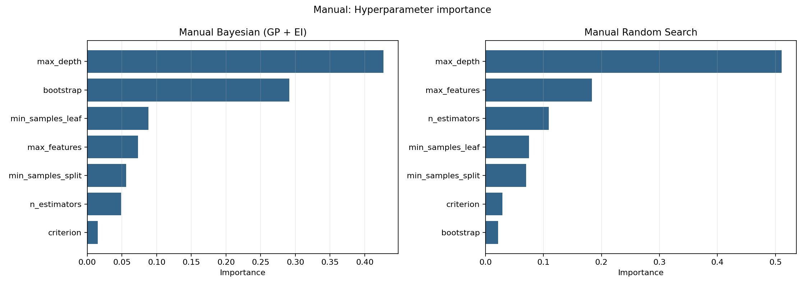

### Optuna: best score vs step

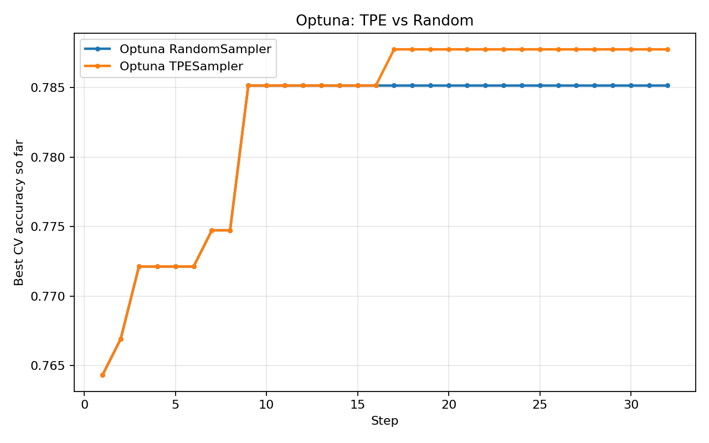

### Optuna: space projection

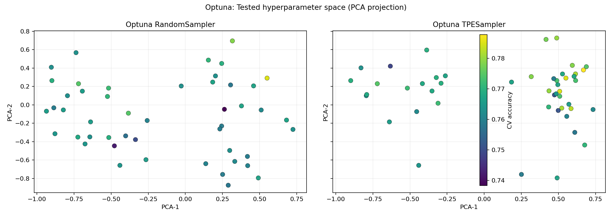

### Optuna: hyperparameter importance

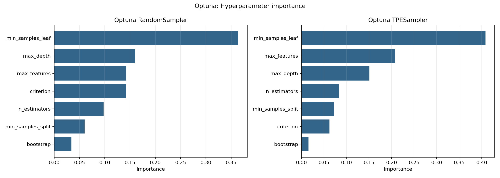

### Графики по каждому гиперпараметру (Manual)

- `n_estimators`: 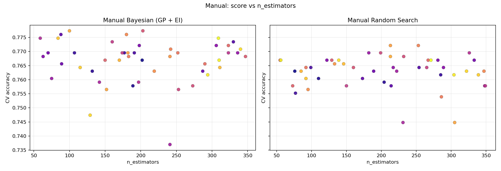
- `max_depth`: 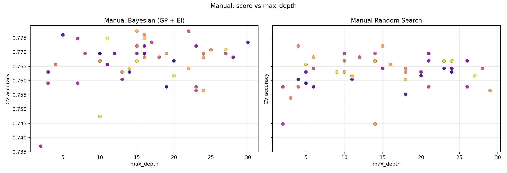
- `min_samples_split`: 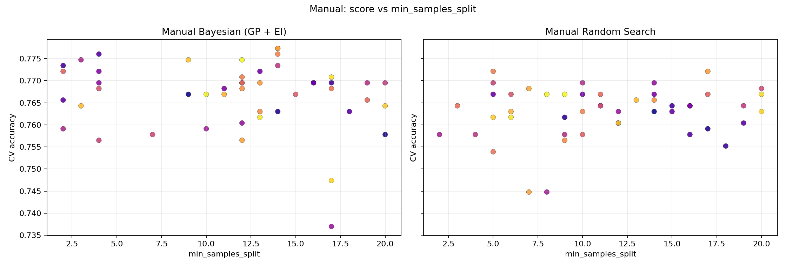
- `min_samples_leaf`: 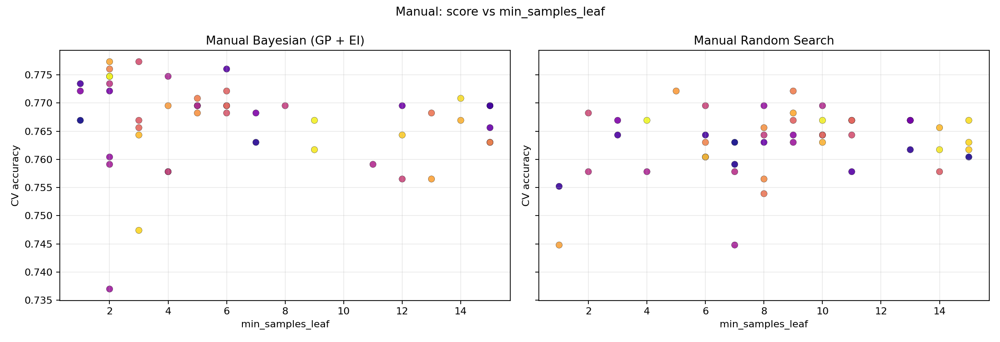
- `max_features`: 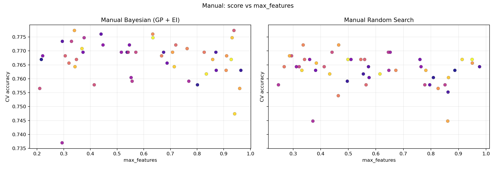
- `bootstrap`: 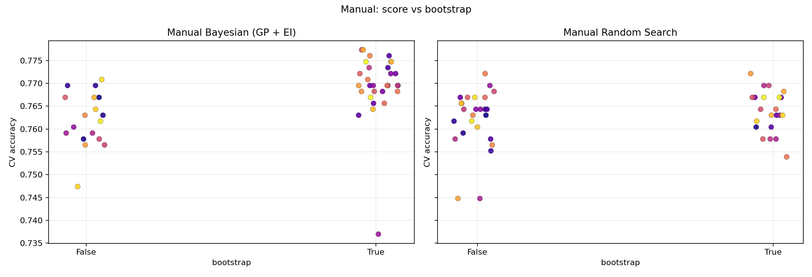
- `criterion`: 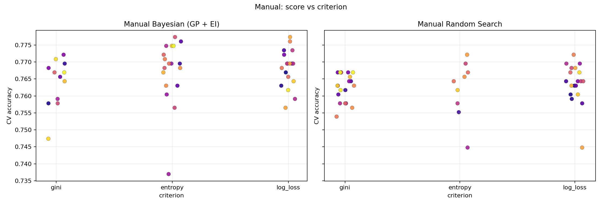

### Графики по каждому гиперпараметру (Optuna)

- `n_estimators`: 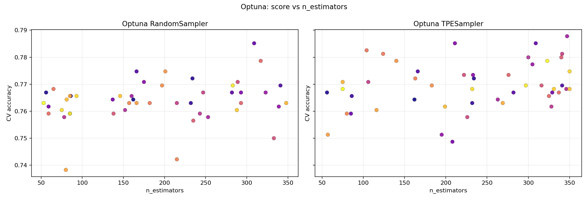
- `max_depth`: 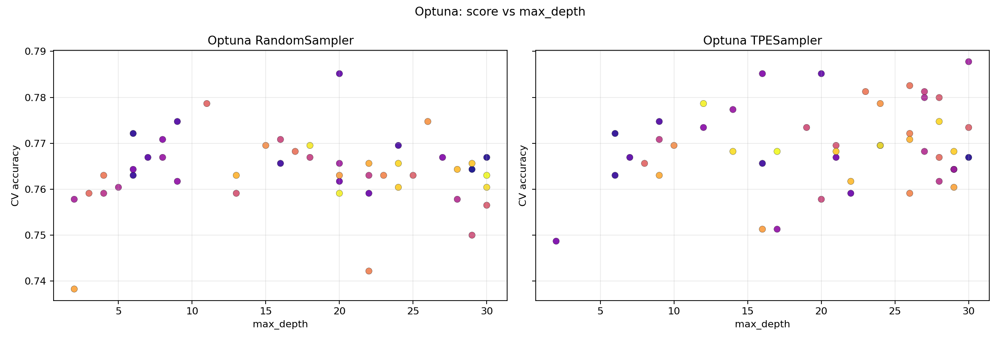
- `min_samples_split`: 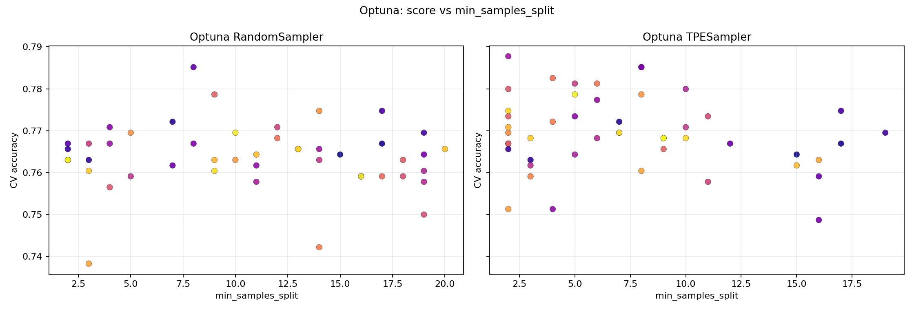
- `min_samples_leaf`: 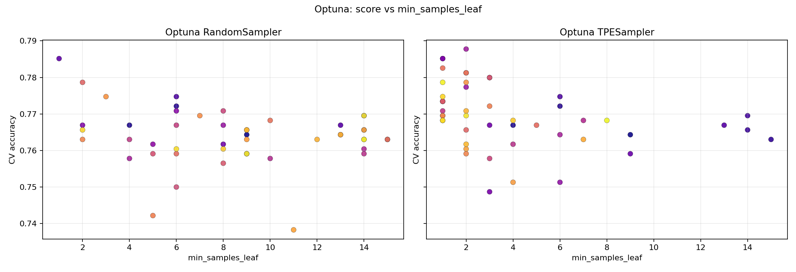
- `max_features`: 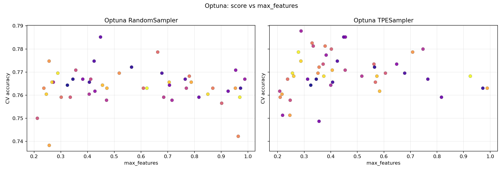
- `bootstrap`: 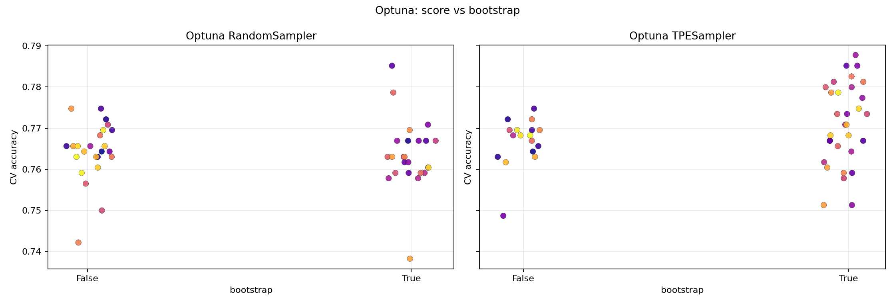
- `criterion`: 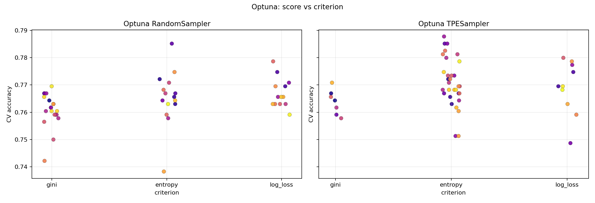

## Краткий вывод

- В обоих сценариях (ручной и Optuna) байесовский подход дал лучший итог, чем random search.
- На OpenML `diabetes` чаще всего важны: `min_samples_leaf`, `max_depth`, `max_features`.
